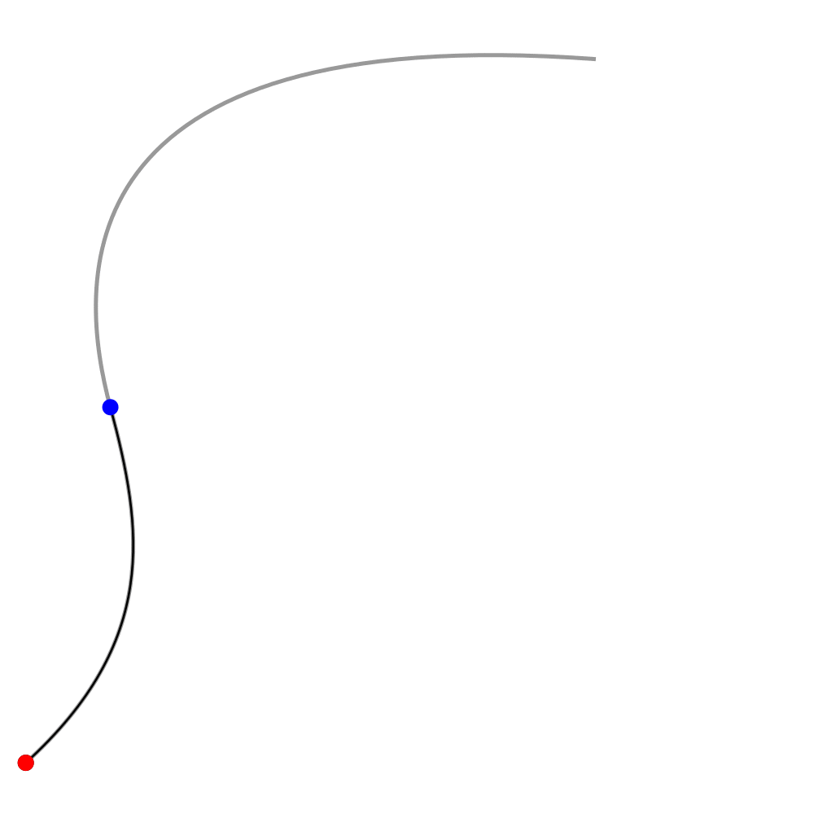
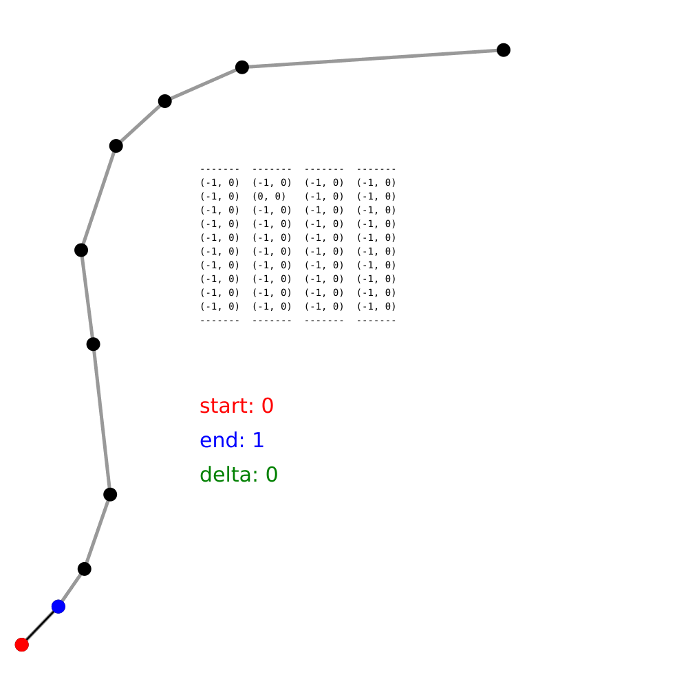
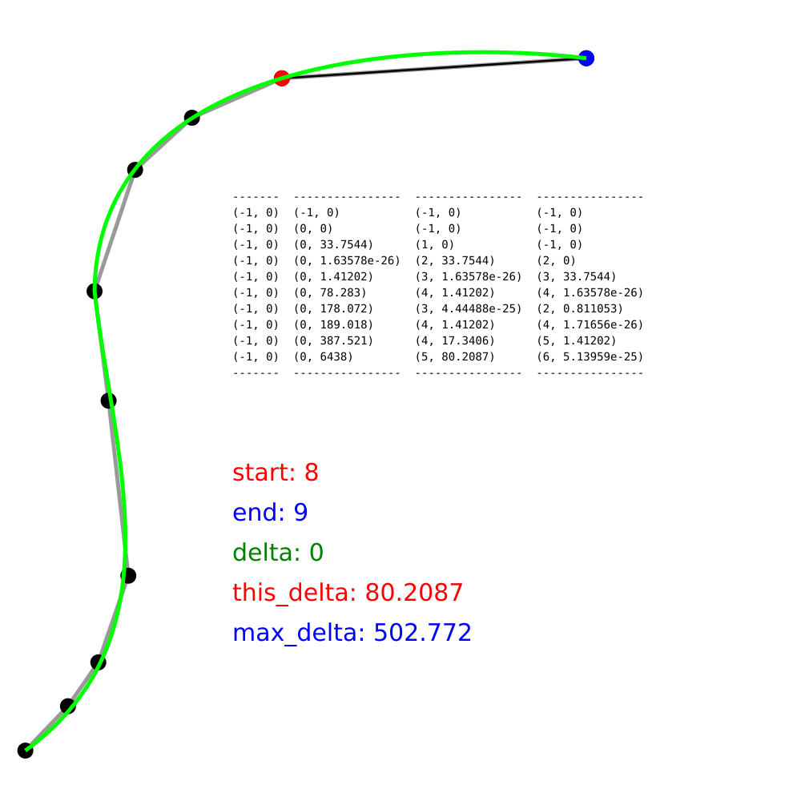

# Path Simplification Algorithms

This report attempts to explain the path simplification algorithms found in *[livarot](https://sourceforge.net/projects/livarot/)* and *[lightvarot](https://sourceforge.net/projects/livarot/files/lightvarot/)*. The goal is to enable the Inkscape developers to understand the algorithms without getting into their code and also to compare both algorithms in terms of computational time and the results they produce. This is so that a good decision can be made regarding which algorithm to use and where.

The operation **simplify** is supposed to reduce the number of redundant nodes from a path. Given a path and a maximum value for the error allowed, you can redraw the path using less nodes but by compromising accuracy. This compromise is often desired by the users as it produces a smoothing effect. Please refer to the following figure. The *S* on the left is the one I drew by hand and the one on the right has simplification applied. 

At the moment, Inkscape relies on a library called *livarot* for the path simplification. It's one of the goals of my GSoC 2020 project to extract this functionality out and rewrite it in a way that's maintainable and understandable. The author of *livarot* rewrote it and named it *lightvarot*. Both libraries have different simplification algorithms. The goal of this report is to explain and compare both of these.

In both of these algorithms, there are two steps for path simplification:

1. Approximate the path by line segments given a threshold value. The smaller the threshold value, the bigger the number of resulting line segments..
2. Fit cubic Bezier curves on the polyline, minimizing the errors and minimizing the number of Bezier curves.

The way they accomplish this is different for both algorithms.

### Lightvarot

Lightvarot is very different from Livarot in the sense that all of the path simplification stuff is limited to a class `PointSequence`. The only way to form this class is by calling the `addPoint` method multiple times followed by a `Simplify` call. The *approximating with line segments* part lives in a separate place that I'll describe below.  I replaced it with my own code which I'll describe too.

#### Approximating with line segments (lightvarot)

Things start in lightvarot with a `Path` class. This stores a path description similar to the `d` attribute of an svg path element. Given a `delta` value, these descriptions can be converted to line segments in the following way:

**MoveTo**

The point is simply added to the sequence of the points.

**LineTo**

The endpoint of the line is added to the sequence of the points.

**CurveTo**

Given a cubic bezier curve defined by the points $\vec{P_0}$, $\vec{P_1}$, $\vec{P_2}$ and $\vec{P_3}$, if the following condition is true, the point $\vec{P_3}$ is added to the sequence of points.

$$
|\vec{P_1}-\vec{P_0}| + |\vec{P_2} - \vec{P_1}| + |\vec{P_3} - \vec{P_2}| < delta
$$

Otherwise, the cubic curve is split into two cubic curves and the same function is called on both of those. So, to summarize, the algorithm is, if the curve is small enough, take its last point, otherwise, keep splitting it into half until it's subsequent curves become small enough.

**ArcTo**

It seems that for arcs the delta isn't taken into account at all. Instead, the arc is simply evaluated at a constant angle interval and points added accordingly.

### Approximating with line segments (my approach)

I wrote some code that uses *lib2geom's* abstractions to approximate a path by line segments. For each curve that makes up a path, the curve is approximated by a line segment that passes through its start and end point. If the maximum possible distance between the curve and the line segment is limited by the threshold the approximation is used, otherwise, the curve is split into two and the same function is called on each of the two curves. This is very similar to how *lightvarot* handles cubic bezier curves. The approach is shown in the following gif.

### Fitting cubic beziers on a polyline

There are two techniques in lightvarot which vary slightly. One relies on an approximation and the other one doesn't. Let's tackle the one without approximations first.

The following figures illustrates how the algorithm works. It fits all the possible cubic curves on all the possible sets of points as you can see. When it fits a curve on a certain set of points, it updates the corresponding entries in the matrix shown. The best way to see what the matrix stores would be to look at the code itself. But here is a good explanation. 

> Each tuple or entry has two values, the first one is `stP` which is a pointer to a previous point and the second one is $delta$ which is the total squared error till that point. A tuple $(stP, delta)$ at the index $(row, col)$ (indexes starting at 0), refers to a path you could take to reach the point $row$, while having a total squared error of $delta$ and a total number of $col$ cubic curves. 

Pause the gif at the last frame (I have attached it below the gif), where you see the final green path and take a look at the matrix. Have a look at the entry $(9, 2)$ that has the value $(5, 80.2087)$ and we get the statement.

> A tuple $(5, 80.2087)$ at the index $(9, 2)$ (indexes starting at 0), refers to a path you could take to reach the point $9$, while having a total squared error of $80.2087$ and a total number of $2$ cubic curves. 

Now let's backtrack. Here `stP` is 5. Which means whatever path this is, the patch previous to the last one ends at point 5. Taking a look at the entry $(5, 1)$ (when back tracking look at the previous column $2-1=1$) whose value is $(0, 78.283)$. Substituting these values in the statement you get.

> A tuple $(0, 78.283)$ at the index $(5, 1)$ (indexes starting at 0), refers to a path you could take to reach the point $5$, while having a total squared error of $78.283$ and a total number of $1$ cubic curves. 

Here, `stP` is $0$, which indicates this is the first patch. Hence the final curve, after backtracking the entry $(5, 80.2087)$, is a curve from $0$ to $5$ and another curve from $5$ to $9$. You can just fit again to get those curves which is what the algorithm does at the end. This, this is a way to reach the last point while using only two cubic bezier curves and a total error of $80.2087$. Let's do the same analysis on the tuple $(6, 5.13\times10^{-25})$ at index $(9, 3)$. Back-tracking we get the tuple $(3, 4.44\times10^{-25})$ at index $(6, 2)$. Going back again, we get the tuple $(0, 1.6357\times10^{-26})$ at the index $(3, 1)$. Thus the total path would consist of three cubic patches, one from $0$ to $3$, another from $3$ to $6$ and the last one from $6$ to $9$. As you can see, you can analyze all the entries of the last row to get all the possible ways to reach the final point. The `col` value would indicate the total number of curves needed to reach that point. For the last entry in this example, `col` is $3$, indicating a path with $3$ cubic curves. Similarly, second last entry is $2$, indicating a path with $2$ cubic curves. We simply choose the one with the least number of curves that satisfied our error threshold.

The technique that uses approximations is slightly different. When the number of points are huge, it skips fitting a curve for all the points. It would fit exactly for the last 20 points, fit every 10 points for the points before the last 20 (and interpolate the average distance to the curve in-between) and fit every 100 points for all the points before $n-200$. This increases the performance significantly.

### Livarot

#### Approximating the curve by line segments

The process is almost exactly the same as that of *lightvarot* except the following few differences.

**LineTo**

When simplifying, Inkscape calls `ConvertEvenLines` which breaks down line segments into smaller line segments of a $size <= delta$. 

**ArcTo**

The line segments are ensured to be smaller than $delta$. 

#### Simplifying the curve

The algorithm is quite a simple one. It starts by fitting a curve on the first few points and calculates the error. If this error satisfies our threshold, it fits even a bigger curve a till the error gets bigger than the allowed error. Once that happens, that curve is fixed and a new one is started. This continues until we reach end of the curve. Now instead of doing this extension in a linear manner, it does it similar to binary search. It would start with fixing a curve on the first 64 points, if all goes well, it'd include the next 64 points too. If things don't go well, it'd fix on the first 32. This continues until it finds the right spot to finish the current curve at and start the next one.

### Performance and Results Comparison

I think it'd be interesting to compare the performance in terms of the time taken and the number of resulting nodes.

| **#** | **Threshold** | Nodes Input | Nodes Livarot | Nodes Lightvarot | Time Livarot | Time Lightvarot |
| ----- | ------------- | ----------- | ------------- | ---------------- | ------------ | --------------- |
| 1     | 0.05          | 31          | 5             | 7                | 0.255 ms     | 7.754 ms        |
| 2     | 0.005         | 31          | 15            | 9                | 1.286 ms     | 83.337 ms       |
| 3     | 0.0005        | 31          | 40            | 12               | 8.725 ms     | 396.712 ms      |
| 4     | 0.0001        | 81          | 163           | 36               | 104 ms       | 1205 ms         |

